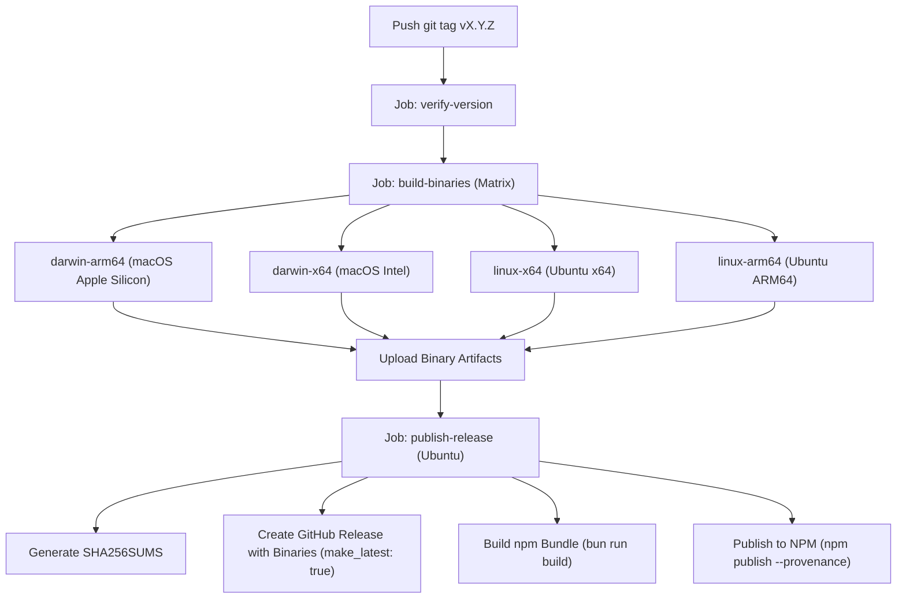

# Release Runbook

This document is the operational runbook for releasing new versions of `pr-hero`. It covers the repository branching model, versioning rules, step-by-step release instructions, CI/CD pipeline automation, post-release verification, and rollback procedures.

---

## 1. Branching Model & Commit Standards

`pr-hero` uses **Trunk-Based Development** centered on the `main` branch:

- **Primary Branch (`main`)**: The stable source of truth. All releases are tagged directly from `main`.
- **Feature & Fix Branches**: Work happens in short-lived branches branched off `main` (e.g. `feat/new-hunter`, `fix/tui-wrap`, `chore/bump-deps`).
- **Pull Request Gating**: Branches merge into `main` via pull requests only after passing automated CI checks (`.github/workflows/ci.yml`: test suite, type checking, linter check, and binary compilation).
- **Conventional Commits**: Commit messages follow the [Conventional Commits](https://www.conventionalcommits.org/) specification:
  - `feat:` New user-facing features or capabilities
  - `fix:` Bug fixes and defect corrections
  - `chore:` Toolchain updates, dependency bumps, maintenance
  - `chore(release):` Release commits bumping versions and changelog
  - `docs:` Documentation improvements
  - `test:` Test additions or test framework refactoring
  - `refactor:` Code restructuring without behavior changes
  - `perf:` Performance optimizations

---

## 2. Versioning Scheme

`pr-hero` adheres to **[Semantic Versioning 2.0.0](https://semver.org/spec/v2.0.0.html)** (`MAJOR.MINOR.PATCH`):

- **`MAJOR`**: Breaking changes to CLI behavior, configuration schema, public API exports, or GitHub Actions contracts.
- **`MINOR`**: Backwards-compatible new features, new agent classes, or enhanced tooling.
- **`PATCH`**: Backwards-compatible bug fixes, performance improvements, or documentation updates.

### Version Synchronization Invariant

The project version is maintained in five locations and must always remain identical:

1. `package.json`: `"version": "X.Y.Z"` — the canonical source of truth.
2. `src/index.ts`: `export const ENGINE_VERSION = "X.Y.Z";` — the published API's version constant.
3. `src/assets.ts` (`resolveVersion()`, fallback `return "X.Y.Z";`) — used only when neither the
   compiled `__PRHERO_VERSION__` define nor a readable `package.json` is available.
4. `src/updater.ts` (`detectInstallMethod()`, `options.version ?? "X.Y.Z"`) — the default version
   assumed when no version is passed in.
5. `install.sh` (`VERSION="X.Y.Z"`) — the fallback used when the GitHub API "latest release" lookup
   fails or returns no tag.

`MCP_SERVER_VERSION` in `src/mcp/preflight.ts` is a separate, independent MCP protocol-server version —
it is not part of this invariant and must not be bumped alongside a package release.

### Git Tagging Strategy

Two distinct tag types are used:

1. **Immutable Release Tags (`vX.Y.Z`)**:
   - Annotated Git tags representing specific point-in-time releases (e.g. `v1.0.0`, `v1.1.0`).
   - Once pushed to GitHub, immutable release tags must **never** be moved or re-pointed.
2. **Floating Major Tags (`v0`, `v1`, `v2`, etc.)**:
   - Floating tags pointing to the latest release within a major version line. The current floating
     tag is `v0` while the project is pre-1.0 (0.x minor bumps may still break the CLI/config/Action
     contract — see the pre-1.0 semantics note below).
   - Consumed by GitHub Actions users referencing the composite action (e.g., `uses: juanmaagd/pr-hero@v0`).
   - Moved/force-updated on every release within that major version line.
   - `v1` is a **frozen legacy tag**: it stopped moving at the last 1.x release (1.1.0) when versions
     were renumbered to 0.x, and must never be moved again. It is kept only so pre-existing workflows
     pinned to `@v1` keep resolving.

### Pre-1.0 semantics (SemVer §4)

While the major version is `0`, a MINOR bump (`0.x.0`) may contain breaking changes to CLI behavior,
configuration schema, or the GitHub Actions contract — SemVer does not guarantee compatibility below
`1.0.0`. Treat every `0.x` release note as "may break" until the project ships `1.0.0` again on its own
merits.

---

## 3. Step-by-Step Release Process

Follow these steps sequentially to execute a release.

### Step 1: Pre-Release Verification

Ensure your local repository is up-to-date with `main` and all verification suites pass:

```bash
# 1. Switch to clean main branch
git checkout main
git pull origin main

# 2. Install dependencies with frozen lockfile
bun install --frozen-lockfile

# 3. Execute test suite, type check, linter, and build bundle
bun test
bun run typecheck
bun run check
bun run build

# 4. (Optional) Run domain-specific probes
bun run fixture-eval
bun run refuter-probe
```

All commands must exit cleanly with code `0`.

### Step 2: Update Changelog

Open `CHANGELOG.md` and prepare the release section:

1. Change `## [Unreleased]` into the new release header: `## [X.Y.Z] - YYYY-MM-DD` (e.g., `## [1.0.0] - 2026-08-25`).
2. Add a fresh, empty `## [Unreleased]` section above it.
3. Update the link references at the bottom of `CHANGELOG.md`:
   ```markdown
   [Unreleased]: https://github.com/juanmaagd/pr-hero/compare/vX.Y.Z...HEAD
   [X.Y.Z]: https://github.com/juanmaagd/pr-hero/releases/tag/vX.Y.Z
   ```

### Step 3: Bump Version Numbers

Update the version string in all five synchronization targets:

- In `package.json`:
  ```json
  "version": "X.Y.Z",
  ```
- In `src/index.ts`:
  ```typescript
  export const ENGINE_VERSION = "X.Y.Z";
  ```
- In `src/assets.ts` (`resolveVersion()`'s fallback, used when neither the compiled define nor
  `package.json` is readable):
  ```typescript
  return "X.Y.Z";
  ```
- In `src/updater.ts` (`detectInstallMethod()`'s default when no version is passed in):
  ```typescript
  const version = options.version ?? "X.Y.Z";
  ```
- In `install.sh` (the fallback used when the GitHub API "latest release" lookup fails):
  ```bash
  VERSION="X.Y.Z"
  ```

### Step 4: Commit and Tag Release

The tag you push in the next step MUST carry the exact version you just set in `package.json` (Step 3):
`.github/workflows/release.yml` now runs a `verify-version` job before anything is built that fails the
whole run with `::error::` when `${GITHUB_REF_NAME#v}` (the tag, minus its leading `v`) differs from
`package.json`'s `version`. Do the version bump and the changelog heading first, commit, THEN tag —
tagging before bumping the version is exactly the mismatch this guard exists to catch.

Create the release commit and annotate the Git tags:

```bash
# 1. Stage modified files
git add package.json src/index.ts src/assets.ts src/updater.ts install.sh CHANGELOG.md

# 2. Create conventional release commit
git commit -m "chore(release): vX.Y.Z"

# 3. Create immutable annotated tag
git tag -a vX.Y.Z -m "Release vX.Y.Z"

# 4. Update the floating major tag (v0 while pre-1.0; e.g. v1 once back on a 1.x.y line)
git tag -fa v0 -m "Release v0 (points to vX.Y.Z)"
```

### Step 5: Push to Remote

Push the release commit, immutable tag, and updated floating tag to GitHub:

```bash
# 1. Push main branch
git push origin main

# 2. Push the immutable release tag
git push origin vX.Y.Z

# 3. Force-push the floating major tag
git push origin v0 --force
```

---

## 4. Automated CI/CD Release Pipeline

Pushing a `v*` tag automatically triggers the GitHub Actions Release Workflow (`.github/workflows/release.yml`):



### Pipeline Workflow Stages

0. **`verify-version`**:
   - Runs first, before anything is built. Compares `${GITHUB_REF_NAME#v}` (the pushed tag, minus its
     leading `v`) against `package.json`'s `"version"`. A mismatch fails the job immediately with an
     `::error::` annotation and nothing else in the pipeline runs.
   - WHY this exists: the compiled binary embeds its version from the **tag** (`__PRHERO_VERSION__` in
     the "Compile standalone binary" step below), while `npm publish` ships whatever `package.json` says.
     Those are two independently-settable strings for the same release — without this gate, a tagging
     mistake ships two different version numbers under one release, silently.
1. **`build-binaries`**:
   - Executes across a matrix of 4 runner environments (`macos-latest`, `macos-15-intel`, `ubuntu-latest`, `ubuntu-24.04-arm`), each on its target's own architecture so the smoke below can execute what it built. `fail-fast: false`, so a failing leg does not cancel the other three — they finish and upload, and the run reports every failure rather than only the first. This does **not** keep the release publishing: `publish-release` has a bare `needs: build-binaries`, so any failed leg skips it. That is deliberate — a release missing one platform binary would give `install.sh` a 404 on that architecture, while a failed release leaves the previous version installable.
   - Runs full test suite and typechecks on each OS.
   - Compiles standalone executables using `bun build --compile --minify` with embedded version definitions.
   - **Runs the compiled binary** (`scripts/compiled-smoke.ts`) before uploading it. v1.0.0 shipped a binary whose `review` failed for every user because this step did not exist.
   - Uploads binary artifacts (`pr-hero-darwin-arm64`, `pr-hero-darwin-x64`, `pr-hero-linux-x64`, `pr-hero-linux-arm64`).
2. **`publish-release`**:
   - Gathers all compiled binaries and computes cryptographic `SHA256SUMS`.
   - Creates a GitHub Release via `softprops/action-gh-release@v2` containing all binaries and checksums,
     with `make_latest: true`. This is explicit rather than left to GitHub's own SemVer-highest default:
     `pr-hero upgrade` and `install.sh` both resolve GitHub's "latest release", and after the 1.x → 0.x
     renumbering the next release (`0.2.0`) is SemVer-**lower** than the already-published `1.1.0` —
     without `make_latest: true`, GitHub would keep calling `1.1.0` latest forever and every
     upgrade/install would silently stay stuck on the old numbering.
   - Generates release notes automatically from commit history and pull requests.
   - Builds the npm distribution bundle and publishes to npm registry with cryptographic provenance using `NODE_AUTH_TOKEN`.

---

## 5. Post-Release Verification

Perform these sanity checks immediately following a release:

1. **GitHub Release Verification**:
   - Visit `https://github.com/juanmaagd/pr-hero/releases/tag/vX.Y.Z`.
   - Confirm all 4 platform binaries and `SHA256SUMS` are attached as release assets.
2. **NPM Registry Verification**:
   ```bash
   # Check published package version
   npm view pr-hero version
   npm view pr-hero dist-tags
   ```
3. **Installer Script Test**:
   - Test standalone installer download in a temporary environment:
     ```bash
     PRHERO_VERSION="vX.Y.Z" curl -fsSL https://raw.githubusercontent.com/juanmaagd/pr-hero/main/install.sh | bash
     ~/.prhero/bin/pr-hero --version
     ```
4. **GitHub Action Reference**:
   - Confirm workflows referencing `juanmaagd/pr-hero@v0` or `juanmaagd/pr-hero@vX.Y.Z` resolve the new
     release. (Workflows still pinned to the frozen `@v1` continue resolving the last 1.x release, by
     design — they receive no further updates.)
5. **Doctor Diagnostic**:
   - Run `pr-hero doctor` locally to verify runtime integrity and toolchain health.

---

## 6. Rollback & Hotfix Procedures

### Scenario A: Urgent Bug Discovered in Released Version

**Rule: Never mutate existing immutable tags or rewrite release history.**

1. Create a hotfix branch from `main`:
   ```bash
   git checkout -b fix/hotfix-issue-name main
   ```
2. Apply the fix and add regression tests.
3. Update `CHANGELOG.md` with patch notes and increment the patch version (`vX.Y.Z+1`) in `package.json` and `src/index.ts`.
4. Merge into `main` and execute the release process for `vX.Y.Z+1`.
5. The floating `v0` tag will automatically update to point to the new patch release, instantly protecting Action users. (The frozen `v1` tag never moves again — see §2.)

### Scenario B: Compromised or Broken NPM Package

If a critical flaw requires immediately warning package consumers:

1. **Deprecate the flawed version on npm**:
   ```bash
   npm deprecate pr-hero@X.Y.Z "Critical issue in X.Y.Z; please upgrade to X.Y.Z+1 immediately."
   ```
2. **Unpublishing (Emergency only)**:
   - NPM allows unpublishing only within 72 hours of initial release if no dependents exist (`npm unpublish pr-hero@X.Y.Z --force`).
   - Prefer deprecation + immediate patch release (`vX.Y.Z+1`) to avoid breaking downstream builds.

### Scenario C: Mispointed Floating Tag

If the floating tag `v0` was pushed to an incorrect commit SHA:

```bash
# Re-align floating tag locally to the correct release commit
git tag -fa v0 <target-commit-sha> -m "Re-align floating v0 tag"

# Force push updated floating tag
git push origin v0 --force
```

Never apply this to `v1` — it is frozen at the last 1.x release and must never be re-pointed.
