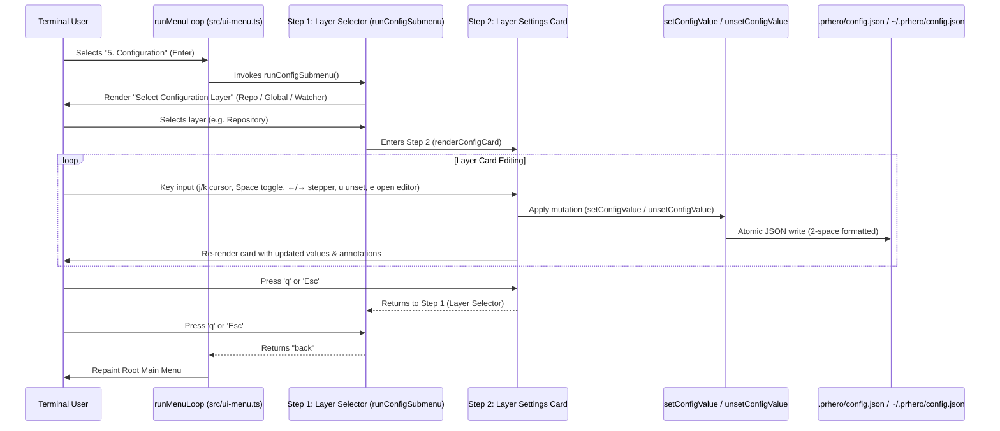

# Design: Interactive Config TUI & Configurable Size Gate

## Architecture Overview



## 1. Schema Extension: Size Gate Keys

### Schema Definition (`src/preflight.ts`)
```ts
export interface LocalConfig {
  agents_dir?: string;
  default_base?: string;
  parity_trigger_paths?: string[];
  suspicion_priors?: string[];
  max_verification_steps?: number;
  max_changed_lines?: number;
  max_changed_files?: number;
  summary?: SummaryConfig;
}

export interface ConfigLayer {
  agents_dir?: string;
  default_base?: string;
  parity_trigger_paths?: string[];
  suspicion_priors?: string[];
  max_verification_steps?: number;
  max_changed_lines?: number;
  max_changed_files?: number;
  summary?: SummaryConfig;
}
```

### Direction & Narrowing
`max_changed_lines` and `max_changed_files` are registered in `CONFIG_DIRECTION` as `"capped"`.
Narrowing function: `Math.min`.
- A repository cannot unilaterally expand a review beyond the personal ceiling set in `~/.prhero/config.json`.
- A repository can set a lower threshold (e.g. 500 lines) to enforce stricter budgets on that project.

## 2. Interactive Editor State & Component Model

### State Shape
```ts
export interface ConfigEditorState {
  layer: "repo" | "person" | "watch";
  cursor: number;
  repoRoot?: string;
  home: string;
  annotation?: string;
}
```

### Presentation Separation
- **Pure Renderers (`src/ui-config-edit.ts`):**
  - `renderConfigHeader(layer: string, width: number, styles: boolean): string[]`
  - `renderConfigItemRows(entries: ConfigEntry[], cursor: number, width: number, styles: boolean): string[]`
  - `renderConfigFooter(selectedEntry: ConfigEntry, width: number, styles: boolean): string[]`
- **Pure Mutations (`src/ui-config-edit.ts`):**
  - `stepNumericValue(current: number, delta: number, min?: number): number`
  - `toggleBooleanValue(current: boolean): boolean`
  - `cycleStringPreset(current: string, presets: string[]): string`
- **I/O & Key Loop (`src/ui-menu.ts` / `src/ui-config-edit.ts`):**
  - Uses `createReader()` pattern with standard raw-mode stdin reader.
  - Keyboard contract:
    - `j` / `k` or `↑` / `↓`: Cursor navigation with modular wrap-around.
    - `Space`: Boolean toggle (immediate write).
    - `←` / `h`: Decrement numeric value (lines: -250, steps: -1, cap: -1).
    - `→` / `l`: Increment numeric value (lines: +250, steps: +1, cap: +1).
    - `Enter`: Cycle preset or toggle boolean.
    - `u`: Unset current key from active layer file.
    - `Tab` or `1-3`: Switch layer (`[1] Repo`, `[2] Person`, `[3] Watcher`).
    - `q` / `Esc`: Exit submenu and return to main menu loop.

## 3. Presets and Formatting

- `max_changed_lines`: Default 1500; step ±250; min 0 (0 = disabled).
- `max_changed_files`: Default 150; step ±25; min 0.
- `max_verification_steps`: Default 8; step ±1; min 0.
- `daily_cap`: Default 10; step ±1; min 1.
- `default_base`: Presets `["main", "master", "develop"]`.

## 4. Error Handling & Edge Cases

- **Outside Git Repo:** When outside a git repository, the Repo layer option is disabled and selecting it shows a dim notice: `(Disabled outside git repository)`.
- **Capped Values:** When editing a repo value above personal ceiling, `setConfigValue` applies the write to `.prhero/config.json` and updates `state.annotation` to notify the user.
- **Terminal Resize (`SIGWINCH`):** Triggers full redraw with updated width.
