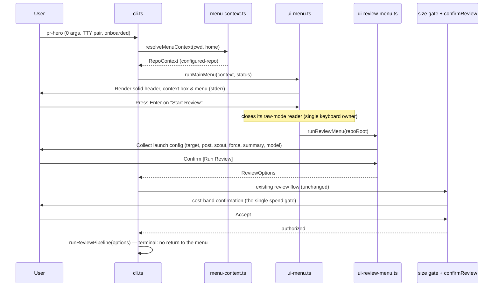

# Design: Pillar 2 — Interactive TUI & Lifecycle Operations

## Architecture Overview

```
                      ┌─────────────────────────┐
                      │  pr-hero [subcommand]   │
                      └────────────┬────────────┘
                                   │
                        subcommand present?
                     /                        \
               [ yes ]                        [ no ] (zero arguments)
                 │                              │
        ┌────────▼────────┐          stdin is a TTY? ── no ──→ help, exit 2 (unchanged)
        │ Script/CLI mode │                    │
        │ (fast, headless)│                   yes
        └─────────────────┘                    │
                                    PRHERO_NO_TUI set? ── yes ──→ help, exit 0 (hatch)
                                               │
                                              no
                                               │
                                    machine onboarded? ── no ──→ runWizard() (unchanged)
                                               │
                                              yes
                                               │
                                    stderr is a TTY too? ── no ──→ help, exit 2
                                               │                  (menu needs the TTY pair)
                                              yes
                                               │
                                     ┌─────────▼─────────┐
                                     │ resolveMenuContext │  (pr-hero menu reaches here
                                     └─────────┬─────────┘   too; TTY pair required)
                        ┌──────────────────────┼──────────────────────┐
                        ▼                      ▼                      ▼
                [ not-a-repo ]       [ unconfigured-repo ]    [ configured-repo ]
                (Global items)       (Init + Global)          (Review + All)
```

The zero-argument branch replaces today's implicit mapping to `review`: opening the menu is the new default for an onboarded machine in a TTY, and starting a review always requires explicit intent. A terminal narrower than 24 columns refuses the TUI ("terminal too narrow", help, exit 2).

## Module Structure

1. `src/menu-context.ts`:
   - Pure context classification: `resolveMenuContext(cwd, home) -> RepoContext`.
   - Dynamic option generation: `menuOptions(context) -> MenuItem[]` (with status badges; the Lifecycle group — Upgrade & sync, Sync skills & MCP → existing `setup`, Managed uninstall; no Reset/Vacuum item).
2. `src/ui-menu.ts`:
   - Pure ANSI renderers: `renderSolidHeader` (width tiers: full >= 60, plain title 24-59, refusal below 24), `renderContextBox`, `renderMenuCard`, and the persistent footer (key hints + the selected item's CLI equivalent from the dispatch matrix).
   - Keyboard interaction loop: raw-mode reader leveraging `splitKeys` / `parseKey` and the `KeyReader` + injected-io pattern from `src/ui-select.ts`; single keyboard owner with close-then-reopen handoff; the `SIGWINCH` listener registered at loop start and removed in the same `finally` that closes the reader.
3. `src/ui-select.ts` (extension):
   - `parseKey` extended to distinguish `Esc` from `Ctrl-C` (today both collapse into one cancel key); existing consumers (`runConfirm`) keep treating both as cancel — a compatible extension with updated tests.
4. `gatherMenuStatus` (impure, in the shell):
   - Collects `MenuStatusInfo` (Repo, MCP, Store, Watcher, Upgrade chips) reusing `doctor` evaluators where applicable; renderers stay pure.
5. `src/activity.ts` & `src/ui-activity.ts`:
   - Impure half: the `~/.prhero/active_runs/` registry (write at review launch, remove on exit, stale-PID pruning with the `lockHolder` liveness probe), the `ps` identity check, SIGTERM/SIGKILL signalling with the 10s escalation, the read-only `runs`-table history query (10-row cap), and the watcher spend read (`countLaunchedToday` + `dailyCap`).
   - Pure half: activity renderers (active runs list with select+Enter kill, spend line, history table, empty state).
   - The review driver installs a SIGTERM handler that tears down its own agent subprocesses via the `StepHandle.kill()` handles it already owns (`src/step-runner.ts`), removes its registry entry, and exits non-zero.
   - Headless twin: `pr-hero activity` and `pr-hero activity --kill <pid>` (`--yes` skips only the confirmation; the identity check and escalation are never skipped).
6. `src/ui-review-menu.ts`:
   - Review launch configuration (target: branch or PR; toggles for `post` — PR targets only —, `scout`, `force`, summary on/off, model presets or free text). Hands off to the existing review flow; never renders cost UI.
7. `src/ui-config-edit.ts`:
   - Interactive configuration editor for Person, Team, and Watcher layers; capped Team keys accept-and-annotate via `CONFIG_DIRECTION`/`SUMMARY_DIRECTION` + `mergeConfig` (the annotation derives from the same merge).
8. `pr-hero config set` / `pr-hero config unset` (CLI paths):
   - Headless parity twins over the same machinery; v1 scalar grammar (incl. `--watch daily_cap <n>` and `--watch window <HH:MM-HH:MM>`); 2-space-indented JSON; `--team` requires a repository.
9. Repo-optional commands (`src/cli.ts`):
   - `doctor` (system checks only), `config` (global layers only), and `setup` (machine-level steps only) become repo-optional; today all three throw outside a repository via `resolveRepoRoot`.
10. `src/updater.ts`:
    - Detection from `process.execPath` (standalone under `~/.prhero/bin/`; source iff `resolveVersion()` is `dev`; npm/bun otherwise) with the shadow-install warning. Phase A: release check on the canonical repo constant, sibling-temp download + SHA256 verification, `.bak` preservation, atomic `renameSync`. Phase B: reconciliation in the new binary via re-exec (`upgrade --reconcile`), `.bak` restore on failed re-exec, idempotent resume, reconciled-version record. `upgrade --check`: always-fresh query rewriting the cache; the 24h TTL governs passive refresh only.
11. `src/uninstaller.ts`:
    - Pure plan generator + side-effect runner with the program/data split (launchd on macOS only, digest-verified MCP/skills inverses, four rc files, standalone binary + `bin/`, dual pre-purge gate — `active_runs` + `lockHolder` —, `--purge` data removal, team-property `.prhero/` prompt).
12. `src/agent-env.ts`:
    - New inverse functions: MCP unregistration and skills removal driven by the skills digest, verified per file (hash-matching files only; modified files left with a notice).
13. `src/home-preflight.ts`:
    - `PrheroLayout` gains `upgradeCheckPath` (`~/.prhero/upgrade-check.json`, which also records the reconciled version).
14. `src/ui.ts`:
    - `box()` gains an optional border style (`"round" | "double"`, default `"round"`), leaving existing callers untouched; a pure control-byte sanitizer (strip `0x00-0x1F`, `0x7F`, ESC sequences) for externally-sourced strings; `MIN_BOX_WIDTH` (24) is the documented width floor behind the TUI's refusal tier.

## Dispatch Matrix

The authoritative wiring contract between menu items and headless commands; the dispatch tests assert it, and the footer derives its CLI-equivalent hint from it.

| Menu item | Dispatches | Shown in | After action |
|---|---|---|---|
| Start Review | review submenu → existing review flow (`pr-hero review [--pr <n>] [flags]`) | `configured-repo` | Terminal |
| Initialize Repo | `pr-hero init` | `unconfigured-repo` | Returns (context re-resolved) |
| Active & recent reviews | activity sub-surface (headless twin and footer hint: `pr-hero activity`) | all | Returns |
| Watcher & daemons | watcher submenu → `pr-hero watch status`/`install`/`uninstall`/`remove` (all); `watch add`, on-push toggle (in-repo) | all | Returns |
| Configure models & caps | `pr-hero config` / interactive editor | all (global layers only outside a repo) | Returns |
| Doctor & diagnostics | `pr-hero doctor` | all (system checks only outside a repo) | Returns |
| Review ledger & triage | `pr-hero ledger` | `configured-repo` | Returns |
| Lifecycle → Upgrade & sync | `pr-hero upgrade` | all | Terminal |
| Lifecycle → Sync skills & MCP | `pr-hero setup` | all (machine-level steps only outside a repo) | Returns |
| Lifecycle → Managed uninstall | `pr-hero uninstall` | all | Terminal |
| Quit | — | all | Terminal (exit 0) |

Returning rows pause ("press any key") so command output stays readable, then the root re-creates its reader and re-renders; terminal rows follow the command's normal exit path. Bare `pr-hero watch` is never dispatched. The Activity item opens the interactive sub-surface in place; `pr-hero activity` is its headless read-only twin and the footer hint, not a literal dispatch.

## Sequence Diagram: Root Menu → Review Launch



The submenu collects configuration only; the size gate and the cost-band `confirmReview` in the existing flow remain the single spend gate. Ownership of the keyboard passes close-then-reopen at every dispatch boundary.

## Key Decisions

1. **Re-exec reconciliation (`upgrade --reconcile`):** reconciliation executed by the old process would run old code against the new binary's expectations (skill payloads, migration set); re-exec into the new binary guarantees the new code reconciles its own state, on the npm/bun path too.
2. **`upgrade` as the verb, no `update` alias:** `update` is ambiguous across ecosystems (apt/brew read it as "refresh the check", npm reads it as "install"), while `upgrade` unambiguously means "install the newer version"; `bun upgrade` and `deno upgrade` are the closest single-binary precedents and pr-hero is a bun-compiled binary; nothing shipped references `update`, so the rename is free now and expensive after release. The check cache is named `upgrade-check.json` so file, flag, and verb agree.
3. **Cooperative kill instead of a process-group kill:** the rev 2 process-group design was unimplementable portably — the watcher spawns reviews via `Bun.spawn` in `src/watch.ts` with no detached/process-group option, so watcher-spawned reviews share the tick's group and the pgid APIs are not exposed from this runtime. Instead the driver's SIGTERM handler tears down its own agents through the `StepHandle.kill()` handles it already owns, the killer verifies identity via `ps` first (PID liveness never authorizes a destructive signal — PID reuse), and a bounded 10s escalation to SIGKILL reports honestly that agents may survive.
4. **Transactional upgrade:** detection keys off `process.execPath` so the upgrader only touches the running installation (shadow installs get a warning, not a mutation); the download lands in a sibling temp file so `renameSync` stays atomic on one filesystem (`EXDEV` otherwise); `.bak` is kept until reconciliation succeeds and restored automatically if the new binary fails to re-exec; reconcile steps are idempotent and resumable; the reconciled version is recorded so `doctor` can flag "reconciliation pending".
5. **`--check` always fresh, TTL for passive refresh only:** `upgrade --check` must be trustworthy on demand, so it always queries and rewrites the cache; the 24h TTL exists so plain `upgrade` runs refresh opportunistically while the menu reads only the cache and never touches the network.
6. **Program/data uninstall split:** removing the program is reversible (reinstall), removing the operator's data is not — so the default uninstall removes the program (plists, MCP, skills, rc lines, standalone binary) and only `--purge` removes the data, behind a dual liveness gate (`active_runs` + `lockHolder`). Skill removal is digest-verified per file because destroying a user-modified file is never acceptable from an uninstaller.
7. **Accept-and-annotate for capped Team keys:** C5's `foldKey` accepts an over-ceiling repo value and narrows only the effective value; the Team file is shared and committed, so the local operator's ceiling must not reject teammates' configuration at write time. The surfaces write any type-valid value and then show the effective-value annotation from the same merge — enforcement stays at merge time.
8. **Single keyboard owner:** exactly one live raw-mode reader at any time, passing ownership close-then-reopen at dispatch boundaries with `finally` restoration and `SIGWINCH` cleanup — two concurrent readers race for the same bytes, and an unclosed reader leaves the terminal raw on crash.
9. **Digits select instead of execute:** the menu contains destructive actions (uninstall, purge, kill), so `Enter` is the only execute key; a stray digit must never launch one.
10. **Single spend gate:** the review submenu only collects configuration; the existing cost-band confirm remains the one place spend is authorized, so cost UI cannot drift across two surfaces.
11. **stderr channel + TTY pair:** the menu renders through the existing `log()` stderr channel so stdout stays pipeable; because it renders to stderr and reads the keyboard, it requires stdin and stderr to both be TTYs — a menu on a redirected stderr would be an invisible keyboard trap.
12. **Honest width floor:** `box()` clamps at `MIN_BOX_WIDTH` (24), so the TUI guarantees no horizontal overflow at width >= 24 and refuses below it instead of pretending.
13. **Control-byte sanitizer:** externally-sourced strings (repo names, branches, paths, PR titles) are stripped of control bytes and ESC sequences in one pure `src/ui.ts` helper — a branch name must not inject into the terminal.
14. **Canonical repo constant:** one exported `Gentleman-Programming/pr-hero` constant, pinned by a test, keeps the Releases API and identity-rendering surfaces from drifting from `README.md`/`install.sh`.
15. **`box()` extension over a second primitive:** an optional border style (`"round" | "double"`, default `"round"`) leaves existing callers untouched and avoids two diverging box implementations.
16. **Ephemeral PID registry with stale cleanup:** one JSON file per running review under `~/.prhero/active_runs/` is crash-safe (a dead PID is pruned on read with the `lockHolder` liveness probe, `EPERM` counting as alive), needs no daemon, and gives the menu a cheap offline badge source.
17. **Lifecycle grouping + persistent footer:** grouping Upgrade & sync, Sync, and Managed uninstall under one Lifecycle item keeps the root menu at eight items with the upgrade badge on the group label, and the footer's CLI-equivalent hint (from the dispatch matrix) teaches the headless surface instead of hiding it.
