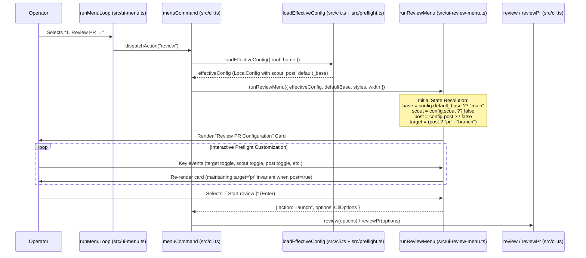
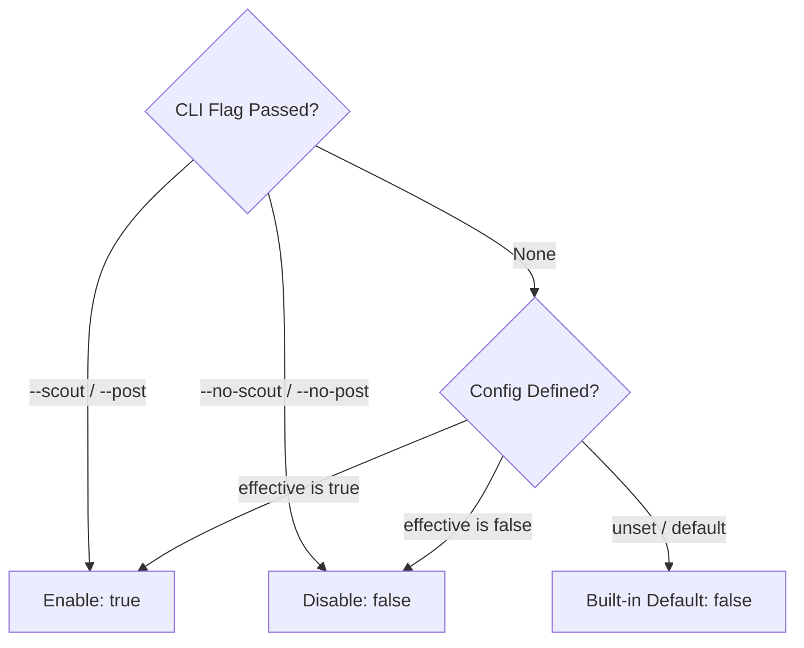

# Design: Review Preflight Config Inheritance & Flags Alignment

## Architecture Overview



## 1. Schema & Config Merge Architecture

### `LocalConfig` Extension (`src/preflight.ts`)
```ts
export interface LocalConfig {
  agents_dir?: string;
  default_base?: string;
  parity_trigger_paths: string[];
  suspicion_priors: SuspicionPrior[];
  summary?: SummaryConfig;
  max_verification_steps?: number;
  max_changed_lines?: number;
  max_changed_files?: number;
  scout?: boolean;
  post?: boolean;
}
```

### Direction & Conjunction Narrowing
Both `scout` and `post` are registered in `CONFIG_DIRECTION` as `"capped"`:
```ts
export const CONFIG_DIRECTION: Record<keyof LocalConfig, ConfigDirection> = {
  agents_dir: "person",
  default_base: "repo",
  parity_trigger_paths: "repo",
  suspicion_priors: "repo",
  summary: "capped",
  max_verification_steps: "capped",
  max_changed_lines: "capped",
  max_changed_files: "capped",
  scout: "capped",
  post: "capped",
};
```
- For boolean spend/mutation flags, `narrower = (a: boolean, b: boolean) => a && b`.
- If an individual sets `"scout": false` or `"post": false` globally in `~/.prhero/config.json`, no repository `.prhero/config.json` can force it to `true`.
- If an individual leaves it unset, the repository preference (`true` or `false`) takes effect with provenance `"repo"`.

## 2. Review Menu State Machine & Auto-Promotion

### Dependency Signature
```ts
export async function runReviewMenu(
  deps: {
    createReader?: () => KeyReader;
    io?: ReviewMenuIo;
    styles?: boolean;
    width?: number;
    effectiveConfig?: LocalConfig;
    defaultBase?: string;
    defaultScout?: boolean;
    defaultPost?: boolean;
  } = {},
): Promise<ReviewMenuOutcome>
```

### Initial State Resolution
```ts
const resolvedBase = deps.defaultBase ?? deps.effectiveConfig?.default_base ?? "main";
const resolvedScout = deps.defaultScout ?? deps.effectiveConfig?.scout ?? false;
const resolvedPost = deps.defaultPost ?? deps.effectiveConfig?.post ?? false;
const resolvedTarget = resolvedPost ? "pr" : "branch";

const state: ReviewMenuState = {
  target: resolvedTarget,
  head: "HEAD",
  base: resolvedBase,
  post: resolvedPost,
  scout: resolvedScout,
  force: false,
  full: false,
  dryRun: false,
};
```

### State Transition Invariants
- **Target Toggled (`cursor === 0`):**
  - `"branch"` -> `"pr"`: `state.target = "pr"`.
  - `"pr"` -> `"branch"`: `state.target = "branch"`, `state.post = false` (cannot post in local branch mode).
- **Post Toggled (`cursor === 2`):**
  - When `state.target === "branch"` and toggled on: `state.target = "pr"`, `state.post = true` (auto-promotes target to PR).
  - When `state.target === "pr"`: `state.post = !state.post`.

## 3. CLI Flags & Precedence Hierarchy

1. **CLI Flag (`--scout` / `--no-scout`, `--post` / `--no-post`):** Highest priority. Overrides all configuration layers.
2. **Merged Effective Config (`effective.scout`, `effective.post`):** Resolved through `mergeConfig(global, repo)`.
3. **Built-in Fallback (`false`):** Default state when unset at all levels.



## 4. UI Config Editors & Provencance Display

- `src/ui-config.ts`: `configRows` maps `scout` and `post` into table rows with layer badges (`global`, `repo`, `capped`, `default`).
- `src/ui-config-edit.ts`:
  - `getEditableLayerEntries` presents `scout` and `post` with `[✓] true` / `[ ] false` toggles.
  - `setConfigValue` warns when team writes are capped by personal global settings.
